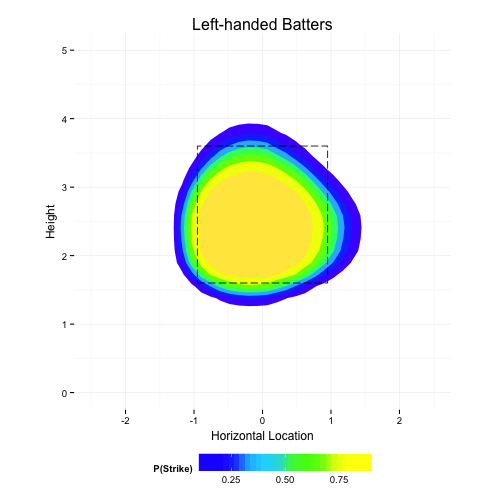

## The MLB STRIKE ZONE

- Question:

  - Does the real Major League Baseball STRIKE ZONE, as called by umpires, conform to the MLB Rulebook's definition?
  
  - If not, what are the true shape and dimensions of the strike zone?

- Major League Baseball Rulebook, Rule 2.00, The STRIKE ZONE   
(<http://mlb.mlb.com/mlb/official_info/umpires/rules_interest.jsp>):

  - "The STRIKE ZONE is that area over home plate the upper limit of which is a horizontal line at the midpoint between the top of the shoulders and the top of the uniform pants, and the lower level is a line at the hollow beneath the kneecap. The Strike Zone shall be determined from the batter's stance as the batter is prepared to swing at a pitched ball."

---

## The Shiny App

The Shiny app has two main parts (switched via the radio button):

1. Plots of pitch densities -- the actual location of pitches thrown -- and colored by whether those pitches were typically called a ball or strike.

2. Plots of a General Additive Model which show the probability that a pitch thrown in a certain location will be called a strike.

- Options
  - The drop down menu allows the user to analyze a selection of MLB pitchers.
  - You can toggle the rulebook-defined strike zone.
  - You can adjust the bounds of the x- and y-axes to zoom.

--- &twocol

## Pitch Density Plot

*** =left

- The dotted black line is an approximation of the MLB Rulebook definition of the STRIKE ZONE.

- The <orange> contour lines represent increasing densities of called strikes. 

- The <dodger blue> contour lines denote increasing densities of called balls. 

- The background coloring of the plot emphasizes each density.

*** =right
 

--- &twocol

## GAM Model Plot

*** =left

- Again, the dotted black line is an approximation of the MLB Rulebook definition of the STRIKE ZONE.

- Each color band represents a different probability that a pitch in a specific location will be called a strike.

- The boundary between the green and light blue bands forms the shape of the modeled STRIKE ZONE. 
  
  - At this decision boundary, there is a 50/50 chance of the pitch being called a ball or strike.

*** =right
 
